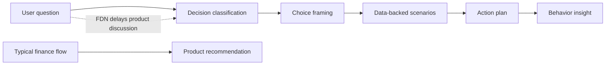
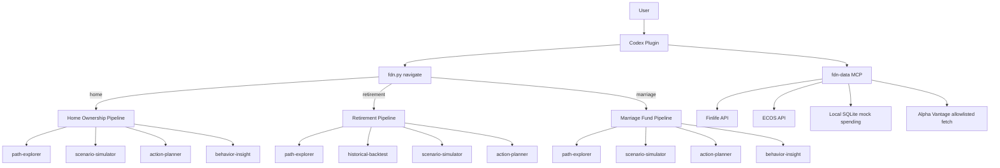
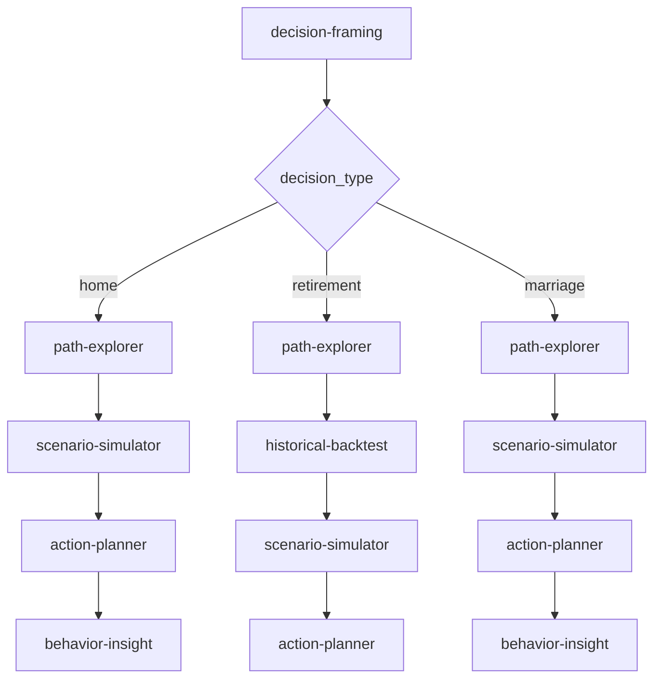
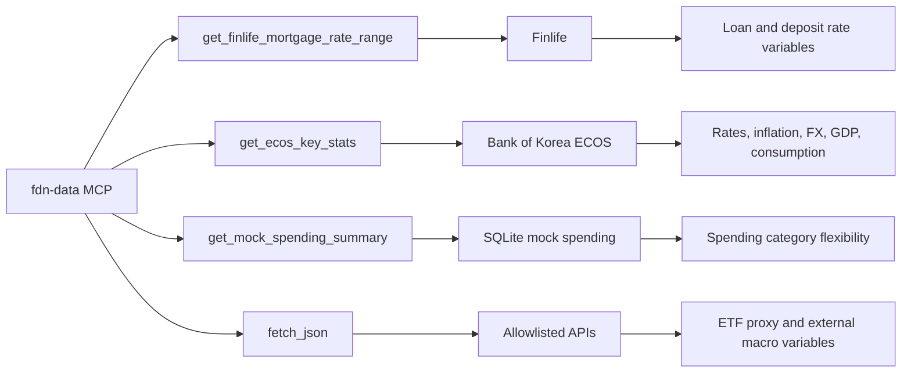

# Financial Decision Navigator

Financial Decision Navigator(FDN)는 주요 생애 금융 결정을 상품 추천보다 먼저 구조화하는 Codex 플러그인입니다. 은퇴, 주택 구입, 결혼 자금처럼 정답이 하나로 고정되지 않는 질문을 선택지, 시나리오, 실행 계획, 소비 행동 인사이트로 분해합니다.

## Core Value



FDN은 사용자를 평가하지 않고, 상품을 먼저 추천하지 않습니다. 사용자가 어떤 결정을 내리는 중인지 이해한 뒤 비교 가능한 선택지와 위험, 필요한 숫자, 다음 행동을 제공합니다.

## Plugin Structure

```text
src/
├── .codex-plugin/plugin.json
├── .mcp.json
├── data/mock_spending.csv
├── skills/
│   ├── action-planner/
│   ├── behavior-insight/
│   ├── decision-framing/
│   ├── historical-backtest/
│   ├── path-explorer/
│   └── scenario-simulator/
├── scripts/
│   ├── fdn.py
│   ├── finlife_client.py
│   ├── ecos_client.py
│   └── fdn_data_mcp.py
├── docs/
└── tests/
```

## Architecture



## Decision Pipeline

| Decision Type | Example Question | Skill Pipeline | Data Sources |
|---|---|---|---|
| `home` | 지금 집을 사야 할까요? | `decision-framing` -> `path-explorer` -> `scenario-simulator` -> `action-planner` -> `behavior-insight` | Finlife, ECOS, local spending data |
| `retirement` | 60세에 은퇴하고 싶어요 | `decision-framing` -> `path-explorer` -> `historical-backtest` -> `scenario-simulator` -> `action-planner` | Alpha Vantage proxy, ECOS |
| `marriage` | 결혼 자금을 어떻게 모을까요? | `decision-framing` -> `path-explorer` -> `scenario-simulator` -> `action-planner` -> `behavior-insight` | Finlife, ECOS, local spending data |



## Data Pipeline



External API values are treated as scenario variables, not as product recommendation grounds. API keys are loaded from the root `.env` only and must not be committed.

```env
FINLIFE_API_KEY=
ECOS_API_KEY=
ALPHAVANTAGE_API_KEY=
FDN_MOCK_SPENDING_DB=src/data/mock_spending.sqlite
```

## Quick Start

Run all commands from the repository root.

### 1. Classify a decision

```bash
python src/scripts/fdn.py navigate "지금 집을 대출받아서 사야할까요 아니면 저축하면서 기다려야할까요"
python src/scripts/fdn.py navigate "60세에 은퇴하고 싶어요"
python src/scripts/fdn.py navigate "결혼 자금을 어떻게 모아야 할까요"
```

### 2. Run the home ownership flow

```bash
python src/scripts/fdn.py paths home
python src/scripts/fdn_data_mcp.py call-tool get_finlife_mortgage_rate_range --arg principal=140000000 --arg years=30 --arg limit=3
python src/scripts/fdn_data_mcp.py call-tool get_ecos_key_stats
python src/scripts/fdn_data_mcp.py call-tool get_mock_spending_summary
python src/scripts/fdn.py action --goal home --target-amount 200000000 --current-asset 60000000 --monthly-budget 1500000 --annual-return 0 --target-years 8
```

### 3. Run the retirement flow

```bash
python src/scripts/fdn.py paths retirement
python src/scripts/fdn.py backtest retirement mixed
python src/scripts/fdn.py scenario retirement mixed recession
python src/scripts/fdn.py action --goal retirement --target-amount 700000000 --current-asset 100000000 --monthly-budget 500000 --annual-return 0.04 --target-years 20
```

### 4. Run the marriage fund flow

```bash
python src/scripts/fdn.py paths marriage
python src/scripts/finlife_client.py savings --type deposit --save-trm 12 --limit 5
python src/scripts/fdn_data_mcp.py call-tool get_mock_spending_summary --arg goal=marriage
python src/scripts/fdn.py action --goal marriage --target-amount 50000000 --current-asset 10000000 --monthly-budget 1500000 --annual-return 0.03 --target-years 2
```

### 5. Run the local MCP tools

```bash
python src/scripts/fdn_data_mcp.py init-db
python src/scripts/fdn_data_mcp.py call-tool get_mock_spending_summary
python src/scripts/fdn_data_mcp.py call-tool list_mock_spending_transactions
```

## Validation

```bash
python -m unittest discover -s src/tests
```

Validated coverage includes:

- natural-language decision routing
- the three supported decision pipelines
- Finlife client behavior with fixtures and live-compatible wrappers
- ECOS client behavior with fixtures and live-compatible wrappers
- local SQLite MCP tools
- stdio MCP tool behavior
- behavior insight wording that avoids comparison or judgment

## Operating Principles

| Principle | Description |
|---|---|
| Do not judge | Do not compare the user against averages or other people. |
| Do not recommend products first | Explain the decision structure before discussing products. |
| Provide choices | Provide choices, tradeoffs, and risks instead of a single answer. |
| Use data as variables | Treat API data as scenario variables, not recommendation proof. |
| Keep keys private | Store API keys in `.env` only and redact them from output. |

## API Scope

Finlife, ECOS, Alpha Vantage, and local SQLite spending data are the current supported integration layer.

Public-data portal APIs are intentionally excluded until the exact housing-market data need is narrowed. FRED is also excluded because US macro data does not materially improve Korea-focused housing decisions without primary local housing price or transaction variables.
